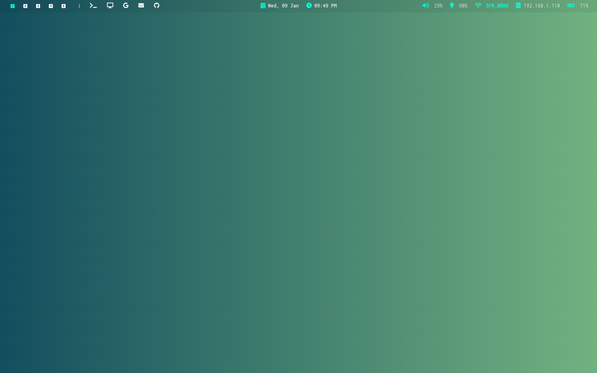
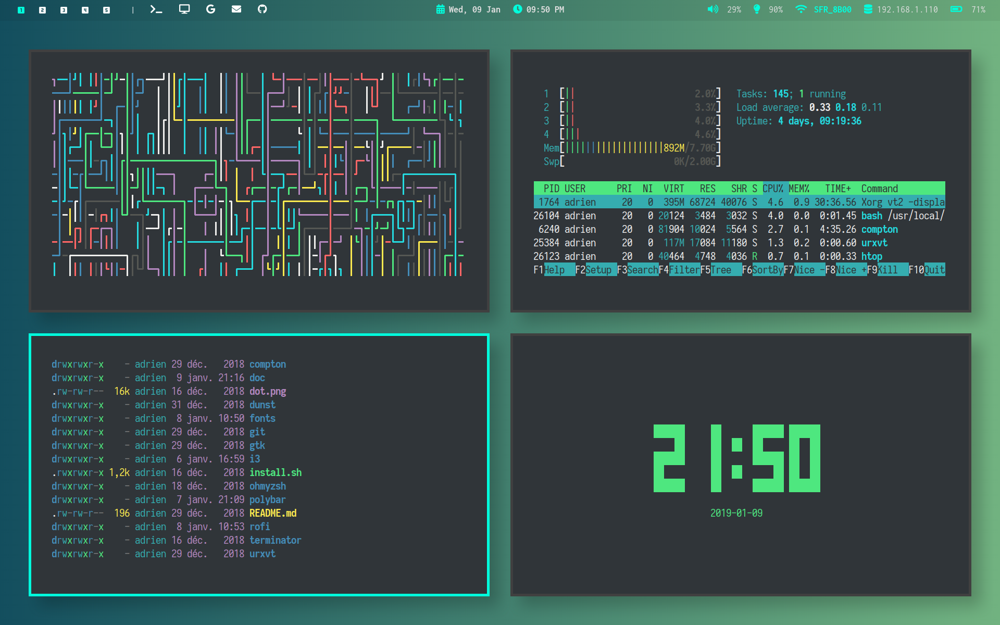
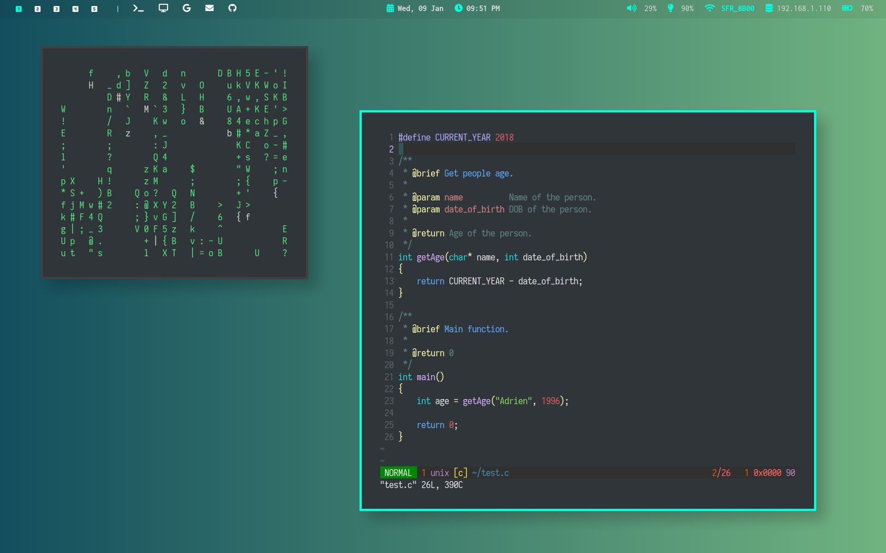
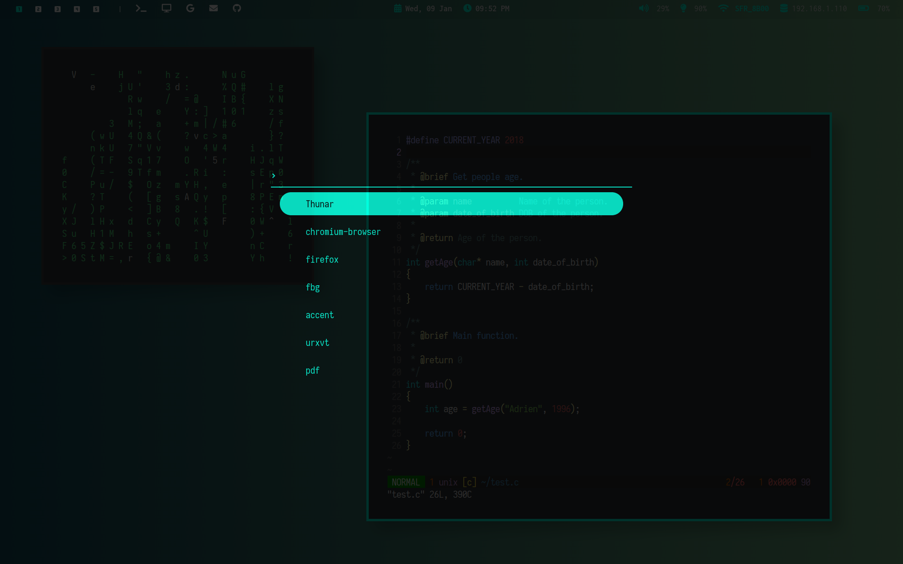
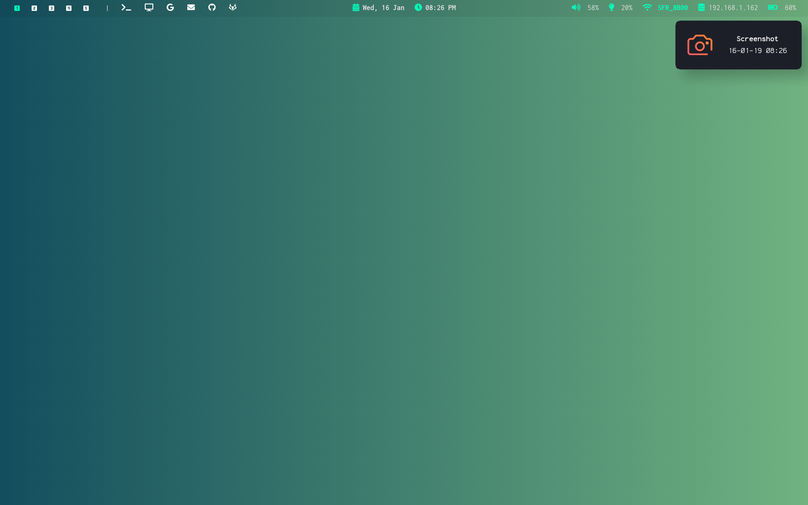

# dotfiles

## Description

My dotfiles for a linux distribution configuration.

**WM**: i3

**Shell**: zsh with ohmyzsh

**Terminal**: urxvt

**Editor**: vim

**File manager**: thunar

**Bar**: polybar

**Compositor**: compton

**Notifications**: dunst

**App launcher**: rofi

**Searcher**: ag - The Silver Searcher

**File finder**: fzf

**File listing**: exa

**Git CLI**: tig

**Font**: Iosevka

## Screenshots

